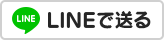

# react-line-button
Simple React components for LINE Button.

**このボタンはスマホ専用です｡** PCユーザーに対しては正常に動作しません｡
**This component is aimed for smart phone users.** It does not work for PC users.

## インストール Install
```
npm install --save react-line-button
```

## 使用例 Example
```javascript
import { LINEButton } from 'react-line-button';

class App extends React.Component {
  render() {
    let text = "LINEで送る";
    let image = "36x60";
    return (
      <LINEButton text={text} image={image} />
    );
  }
}
```

## プロパティ props

### テクスト text

送信する内容を指定します｡ 原則､ ページタイトル､ ページURLの指定が可能です｡
The text you want to share. You can only specify the page title and page URL.

- [ガイドライン](https://media.line.me/guideline/ja/)
- [Guideline](https://media.line.me/guideline/en/)

### 画像 image

ボタンとして表示する画像のサイズを指定します｡

##### 20x20


##### 30x30


##### 36x60


##### 40x40


##### 82x20


MIT licensed
